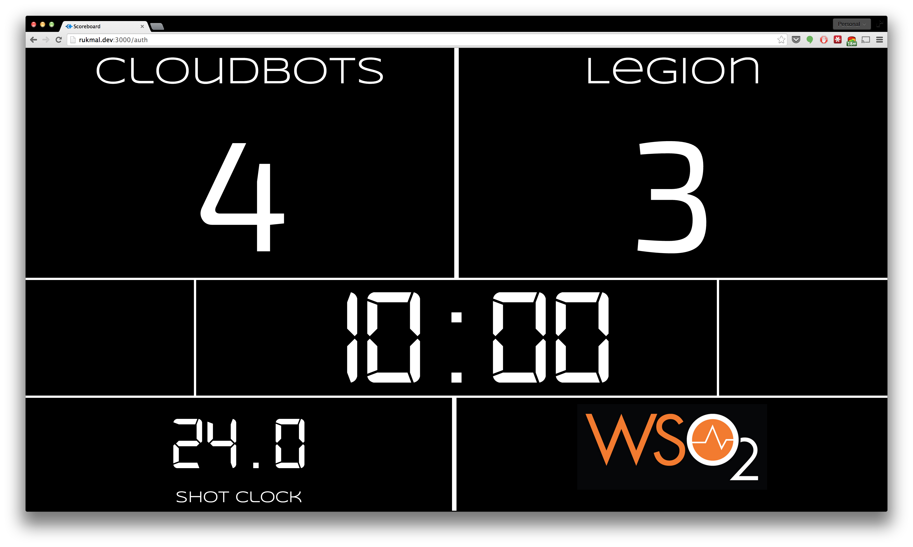
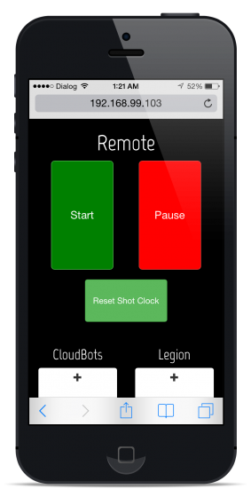

# Scoreboard


Scoreboard is a simple, secure and easy to use Scoreboard application built on [Node.js](http://nodejs.org) and [Socket.io](http://socket.io).

Scoreboard uses Socket.io's real time bidirectional event based communication system to integrate the scoreboard to the mobile-ready remote in real time.

## Usage

Clone the repository from GitHub by running the following in the terminal.
```bash
$ git clone https://github.com/rukmal/Scoreboard.git
```

All of the Scoreboard configuration is stored in the ```config.json``` file. It must have the following data:

```JSON
{
	"_comment": "All times must be in milliseconds",
	"tournament_logo": "",
	"team_home": "",
	"team_away": "",
	"password": "",
	"half_length": 0,
	"timeout_length": 0,
	"halftime_length": "",
	"shot_clock_length": 0
}
```

*Note: all fields filled with a '0' must be numbers. Also note that the configuration file is loaded when the application starts, so if any changes are made, the app must be restarted.*

Next, install all dependencies using npm (the Node.js package manager) and run the application.
```bash
$ cd Scoreboard
$ npm install
$ node app.js
```

Navigate to ```localhost:3000``` in your browser and enjoy!

## Screenshots

- Main scoreboard


- Remote on an iPhone 5



## Contact

This is an open source project released under the [MIT License](LICENSE). Contact me if you want to suggest an improvement, or fork and send a pull request!

Follow me on Twitter ([@rukmal](http://twitter.com/rukmal_w)) and [GitHub](http://github.com/rukmal).

http://rukmal.me