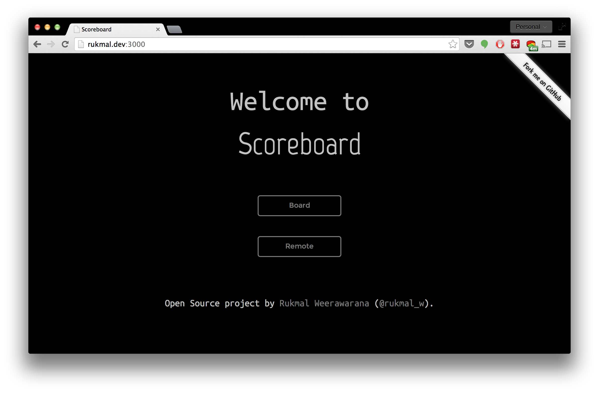

# Scoreboard



Scoreboard is a simple, secure and easy to use Scoreboard application built on [Node.js](http://nodejs.org) and [Socket.io](http://socket.io).

Scoreboard uses Socket.io's real time bidirectional event based communication system to integrate the scoreboard to the mobile-ready remote in real time.

## Usage

All of the Scoreboard configuration is stored in the ```config.json``` file. It must have the following data:

```JSON
{
	"_comment": "All times must be in milliseconds",
	"team_home": "",
	"team_home_logo": "",
	"team_away": "",
	"team_away_logo": "",
	"password": "",
	"half_length": "",
	"timeout_length": "",
	"halftime_length": ""
}
```

The configuration file is loaded when the application starts, so if any changes are made, the app must be restarted.